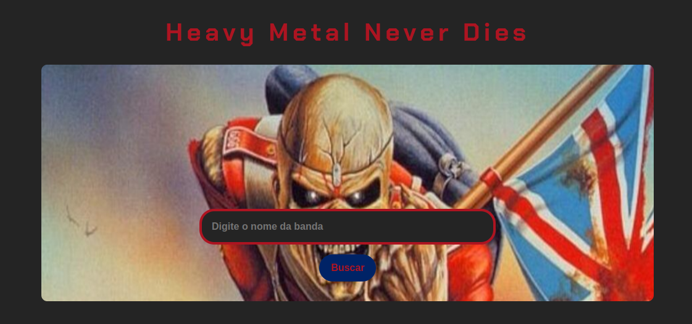

# Heavy Metal Never Dies

## Projeto Imersão Alura com Gemini

## Tecnologias utilizadas

O projeto Heavy Metal Never Dies é fruto da proposta de projeto trazido durante a Imersão Dev Alura com Gemini,
onde utilizamos a IA do Google para nos auxiliar na criação de um banco de dados de nosso interesse, para a criação
de um site utilizando HTML, CSS e JavaScript.

Acesse o projeto aqui: <https://imersao-dev-com-gemini-inky.vercel.app/>
